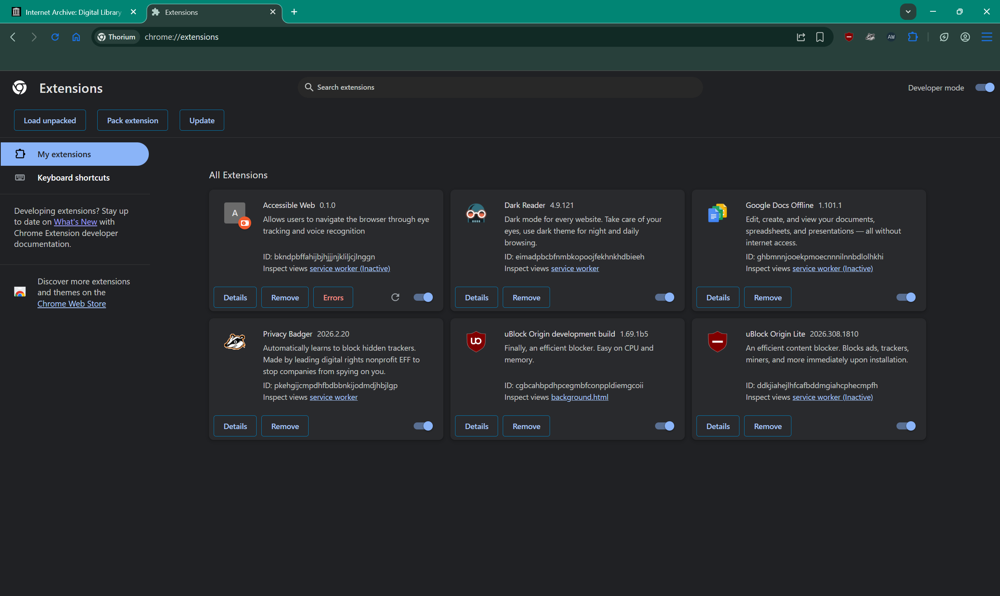
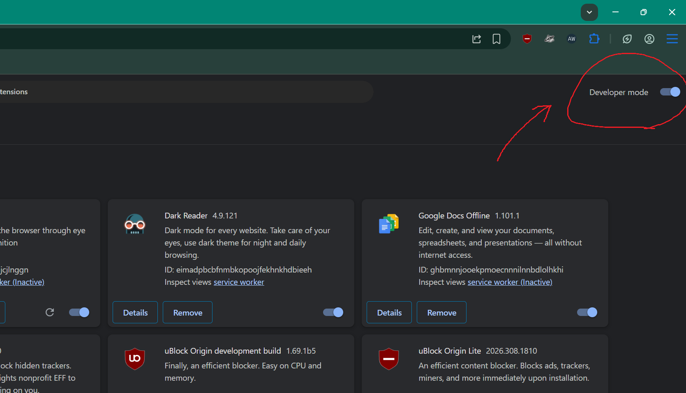
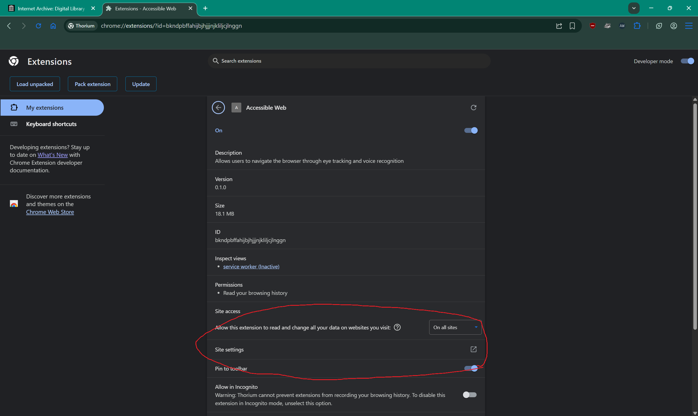
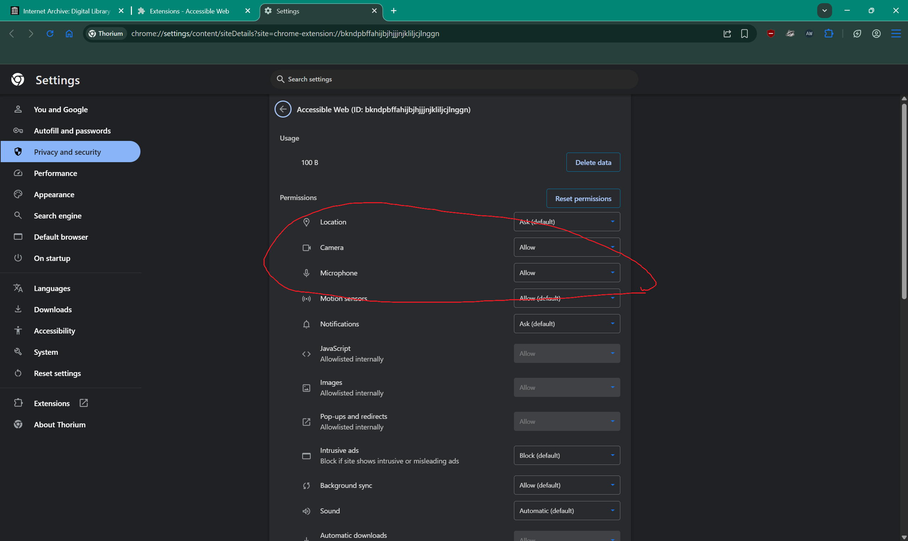
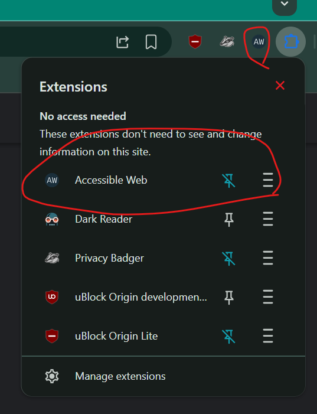
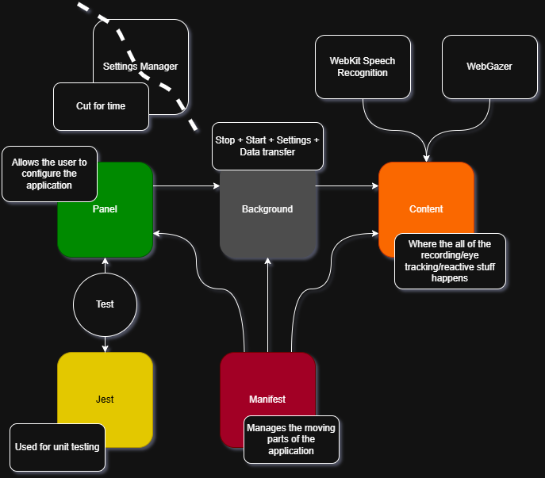

# PRO200 Eye Tracker

## What is this project?
- This is our project for PRO200 Software Projects in Emerging Platforms
- We are aiming to create a browser extension that enables people with a limited range of motion to browse the web effectively.
- Control is intended to be handled through voice recognition and eye tracking technologies.

## For Users
#### Getting it Running
- ** IMPORTANT, this extension was made for chromium based browsers under Manifest V3, support for other browsers is not tested and likely not possible. (Tested with Thorium, Chrome, and Opera GX)
- Getting started
    - Start by either cloning the repo ```git clone https://github.com/MichaelVanatta/PRO200EyeTracker.git``` in a terminal, or downloading the zip archive provided by GitHub after clicking the code button (where the clone link lives).
    - Open your chromium-based browser of choice and navigate to the extensions menu:
    
    - Enable developer mode in the upper right-hand corner
    
    - Now, load the extension as an unpacked extension (the option should appear after enabling developer mode), it should open a file dialogue box, point it to where you cloned/unzipped the extension, and then under the src folder. (It has to be given the path where the `manifest.json` lives, or it won't load)
    - Additional settings may have to be enabled, depending on your microphone settings. To do this, click the `Details` button on the extension, and then click on the option that says `Site settings`:
    
    - Make sure Camera and Microphone are Allowed:
    
    - Finally, install the required language packs by navigating the extensions popout menu (click on the extension from the extensions bar next to the search field, you may need to pin the extension or click the puzzle piece icon)
    
    - Click the big green `Install Needed Files Here` button, and you're golden.

#### Using the Extension
- It starts running by default.
- There are several spoken commands for operating the application
    - Click | Select - Select the element that the eye tracking pointer is currently above.
    - Dictate | Write - Record the user's voice until they stop talking, and place the transcript in a selected text field
    - Stop | Kill | Die - shuts down the process and kills the currently running process

- There is a menu for controlling application settings. The majority of the settings were cut for time, so it is just an on/off switch for voice recognition and eye tracking separately, the switch can be used to reset the application without restarting the extension.
- There is also a manual control for downloading the language packs for voice recognition if they are not already installed.
- The eye tracker position is indicated by a dot. The dot will select whatever element is at the dot's position when the select command is spoken, if it is selectable.

## For Developers
#### Tech Stack
- We are making a Manifest V3 Chrome Extension
- We heavily rely on the Chrome API for message sending/handling, tabs, and storage.
- The extension uses the built in WebKit Voice Recognition API supported by the majority of chromium-based browsers
- We are using WebGazer.js to handle eye tracking

#### Architecture


#### Unit Tests
- For unit testing we are using Jest and its experimental support for ECMAScript Modules.
- To run the existing tests simply run ```npm test``` at the project's root directory (one above src, where package.json lives)
- There are not many tests currently implemented, only the things that can be tested without breaking (Jest doesn't like WebKit Speech Recognition).

#### Current issues
- We are currently relying almost entirely on bundling our code into one big content script, and loading that into any page.
    The `dictationrecognizer.js` and `commandlistener.js` are effectively deprecated now, as we are now directly modifying the `content.js` instead.
    This comes with limitations, the extension cannot interact with any real browser elements and can only interact with DOM elements in the current page.
